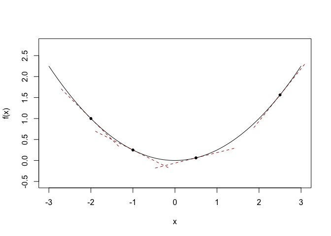
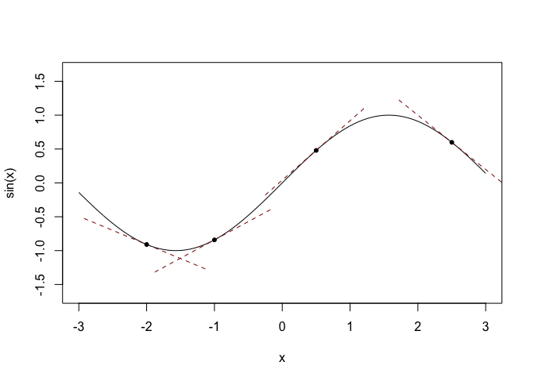
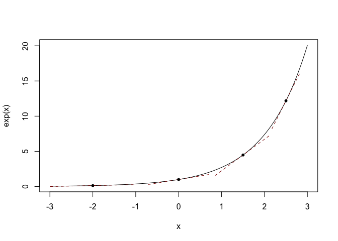

[](https://travis-ci.org/mailund/dfdr) [](https://codecov.io/github/mailund/dfdr?branch=master) [](https://coveralls.io/github/mailund/dfdr?branch=master)

dfdr — Automatic differentiation of simple functions in R
=========================================================

The `dfdr` package implements a simple version of automatic differentiation. It takes functions that consist of a single expression and construct the derivative with respect to a specific variable.

To install `dfdr` you can use `devtools`.

``` r
install.packages("devtools")
devtools::install_github("mailund/dfdr")
```

and then load the library with

``` r
library(dfdr)
```

To compute the derivative of a function, you use the function `d`. It takes two arguments, the function to compute the derivative of and the variable to compute the derivative with respect to.

``` r
f <- function(x) 1/4*x^2
df <- d(f, x)
df
```

    ## function (x) 
    ## (0 * 4 - 1 * 0)/4^2 * x^2 + 1/4 * (2 * x^(2 - 1) * 1)

We can plot a function together with selected tangents to see how it works:

``` r
plot_tangent <- function(f, var, at, L = 1, df = NULL) {
  if (is.null(df)) {
    x <- substitute(var)
    df <- d(f, x)
  }
  a <- df(at)
  w <- L / sqrt(1 + a^2)
  v <- a * w
  x <- c(at - w, at + w)
  y <- c(f(at) - v, f(at) + v)
  lines(x, y, lty = "dashed", col = "darkred")
  points(at, f(at), pch = 20)
}

x <- seq(-3, 3, length.out = 100)
plot(x, f(x), type = "l", asp = 1)
plot_tangent(f, x, -2)
plot_tangent(f, x, -1)
plot_tangent(f, x, 0.5)
plot_tangent(f, x, 2.5)
```



``` r
plot(x, sin(x), type = "l", asp = 1)
plot_tangent(sin, x, -2)
plot_tangent(sin, x, -1)
plot_tangent(sin, x, 0.5)
plot_tangent(sin, x, 2.5)
```



``` r
plot(x, exp(x), type = "l")
plot_tangent(exp, x, -2, L = 1)
plot_tangent(exp, x, 0.0, L = 1)
plot_tangent(exp, x, 1.5, L = 3)
plot_tangent(exp, x, 2.5, L = 4)
```



The body of the deriatives are not simplified right now, so they tend to be more complex than you would normally see them. When computing the derivative, `d` simply follows simple rules for computing the derivatives of expressions and handles complex expressions using the chain rule. I plan to add partial evaluation to the function later to simplify expressions.

Currently, it just handles arithmetic expressions, but I will implement handling of functions in the expressions as well, soon.
